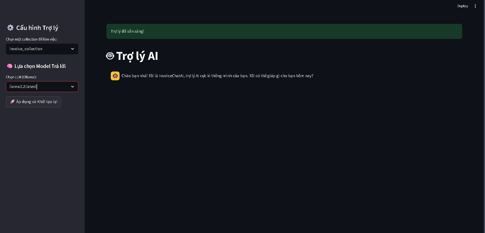
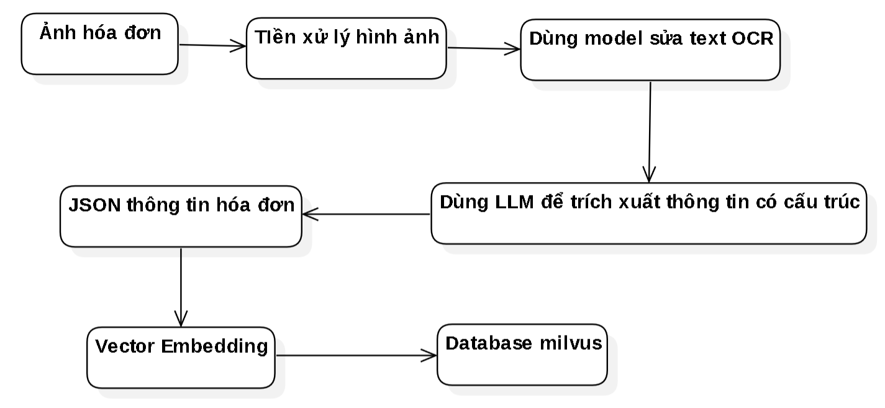

# 🧾 AI Invoice Recognition and Storage Automation  
*(Ứng dụng Trí Tuệ Nhân Tạo trong Nhận Diện và Tự Động Hóa Lưu Trữ Hóa Đơn)*  


---

## 📖 Overview *(Tổng quan)*  
This project implements an end-to-end AI system that automates invoice image processing — from OCR extraction to semantic search and chatbot interaction.  
*(Dự án này xây dựng hệ thống AI tự động hóa xử lý ảnh hóa đơn, từ trích xuất OCR đến tìm kiếm ngữ nghĩa và chatbot hỗ trợ người dùng.)*

<p align="center">
  
</p>
---

## 🎯 Objective and General Solution *(Mục tiêu và Giải pháp Tổng thể)*  
The main goal is to transform messy invoice images into a structured, searchable knowledge base — replacing error-prone manual work with an intelligent automated pipeline.  
*(Mục tiêu là biến ảnh hóa đơn lộn xộn thành cơ sở dữ liệu có tổ chức, thay thế quy trình thủ công dễ sai bằng hệ thống tự động thông minh.)*

The system is designed across **three interactive tabs**:  
*(Hệ thống gồm ba giao diện chính:)*  

- **Upload Tab** – Performs preprocessing, OCR with Tesseract, and LLM-based field extraction (vendor, date, total, etc.).  
  *(Thực hiện tiền xử lý ảnh, OCR bằng Tesseract, và trích xuất thông tin bằng mô hình ngôn ngữ lớn LLM.)*  
<p align="center">
  
</p>
- **Result Tab** – Displays original vs extracted data, allowing manual correction before storing structured JSON in Milvus vector DB.  
  *(Hiển thị song song ảnh gốc và dữ liệu số hóa, cho phép chỉnh sửa trước khi lưu vào cơ sở dữ liệu vector Milvus.)*
<p align="center">
  
  
</p>
- **Chatbot Tab** – Enables semantic queries like “How much did I spend on travel this month?” using RAG architecture.  
  *(Hỗ trợ truy vấn tự nhiên bằng tiếng Việt thông qua mô hình RAG, ví dụ: “Tháng này tôi đã chi bao nhiêu cho việc đi lại?”)*  

<p align="center">
  
</p>

---

## 🧩 Theoretical Background & Technologies *(Cơ sở Lý thuyết và Công nghệ)*  

### 🗂️ Dataset *(Nguồn dữ liệu)*  
The system was trained and tested on **1150+ invoice images** from:  
*(Hệ thống được huấn luyện và kiểm tra trên hơn 1150 ảnh hóa đơn từ:)*  
- Roboflow Dataset (~1000 images) — mixed formats for OCR and document analysis.  
  *(Dữ liệu Roboflow gồm nhiều định dạng ảnh scan/chụp hỗ trợ OCR và phân tích tài liệu.)*  
- Local Vietnamese invoices (~150 images) — Bách Hóa Xanh receipts in VND format.  
  *(Dữ liệu thực tế từ Bách Hóa Xanh với ngôn ngữ và định dạng tiền tệ Việt Nam.)*  

### ⚙️ Algorithms and Methods *(Thuật toán và Phương pháp)*  
- **Image Processing:** Gaussian Blur, OTSU Thresholding, Morphological operations.  
  *(Tiền xử lý ảnh bằng các kỹ thuật Gaussian Blur, OTSU Thresholding, và toán tử hình thái.)*  
- **OCR:** Tesseract OCR for text extraction.  
  *(Sử dụng Tesseract OCR để nhận diện ký tự từ ảnh hóa đơn.)*  
- **Text Embedding:** SentenceTransformer “dangvantuan/vietnamese-document-embedding”.  
  *(Mã hóa văn bản hóa đơn thành vector ngữ nghĩa bằng SentenceTransformer.)*  
- **Vector Storage:** Milvus DB with IVF_SQ8 indexing.  
  *(Lưu trữ và truy vấn vector trong cơ sở dữ liệu Milvus với chỉ mục IVF_SQ8.)*  
- **Prompt Engineering:** Gemini LLM for JSON information extraction and consistency check.  
  *(Sử dụng Gemini LLM để trích xuất dữ liệu có cấu trúc và kiểm tra tính nhất quán.)*  

<p align="center">
  
</p>

### 💡 Innovation *(Tính đổi mới)*  
This system is tailored for Vietnamese invoices — improving accuracy by 20–30% compared to generic global models.  
*(Hệ thống được tối ưu cho tiếng Việt, nâng độ chính xác lên 20–30% so với các mô hình OCR quốc tế không chuyên biệt.)*  


---

## 🧠 Implementation and Experiment *(Triển khai và Thực nghiệm)*  

### 🏗️ OCR & Data Extraction *(Hệ thống OCR và Trích xuất dữ liệu)*  
- **Preprocessing:** Resizing → Grayscale → Blur → Threshold → Morphology.  
  *(Tiền xử lý ảnh qua chuỗi bước làm sạch, làm rõ và nhị phân hóa.)*  
- **OCR:** `pytesseract` with Vietnamese config (`lang='vie'`).  
  *(Trích xuất văn bản tiếng Việt bằng Tesseract OCR.)*  
- **Error Correction:** Seq2Seq model `bmd1905/vietnamese-correction-v2`.  
  *(Sửa lỗi chính tả và ngắt dòng sai bằng mô hình Seq2Seq.)*  
- **Structured Extraction:** Gemini LLM converts text → JSON (fields, totals, etc.).  
  *(Gemini LLM chuyển văn bản sạch thành JSON có cấu trúc gồm các trường chính.)*  

<p align="center">
  
</p> 

### 💬 Chatbot Query System *(Chatbot Truy vấn Hóa đơn)*  
- **RAG Architecture:** Queries converted to vectors, matched via Milvus retriever.  
  *(Kiến trúc RAG: truy vấn được biểu diễn bằng vector và tìm kiếm ngữ nghĩa trong Milvus.)*  
- **Agent Logic:** LangChain agent combines history and retrieved data for context-aware answers.  
  *(Agent LangChain kết hợp lịch sử hội thoại và kết quả truy xuất để sinh câu trả lời tự nhiên.)*  
- **Frontend:** Built with Streamlit for interactive user chat.  
  *(Giao diện người dùng phát triển bằng Streamlit, hỗ trợ chat trực tiếp.)*  

<p align="center">
  
</p>

### 📊 Results and Limitations *(Kết quả và Hạn chế)*  
- OCR accuracy: **80–90%** on clear invoices.  
  *(Độ chính xác OCR đạt 80–90% với ảnh hóa đơn rõ nét.)*  
- Chatbot: Near-instant responses, capable of semantic queries.  
  *(Chatbot phản hồi nhanh và hiểu truy vấn ngữ nghĩa.)*  
- Limitations: Slower response (10–15s) under heavy load, lower accuracy for blurry images.  
  *(Hạn chế: tốc độ xử lý chậm với ảnh mờ hoặc truy vấn lặp lại nhiều lần.)*  


---

## 🔧 Installation *(Cài đặt)*  
*(Phần này bạn tự hoàn thiện sau)*  
> ```bash
> # Clone repository
> # Install dependencies
> # Run Streamlit or FastAPI server
> ```

---

## 🏁 Conclusion & Future Work *(Kết luận và Hướng phát triển)*  
The system successfully delivers an AI-driven end-to-end automation pipeline for invoice digitization and semantic search.  
*(Hệ thống đã hoàn thiện quy trình tự động hóa hóa đơn đầu-cuối, hỗ trợ trích xuất, lưu trữ, và truy vấn ngữ nghĩa hiệu quả.)*

**Future plans include:**  
*(Hướng phát triển tương lai:)*  
- Upgrading OCR with CNN/ResNet deep learning models.  
  *(Nâng cấp mô hình OCR bằng mạng nơ-ron sâu CNN/ResNet.)*  
- Smart AI querying for accounting/audit departments.  
  *(Tích hợp truy vấn AI thông minh phục vụ phòng kế toán/kiểm toán.)*  
- Cloud deployment and secure authentication (JWT/OAuth2).  
  *(Triển khai cloud và bảo mật bằng JWT/OAuth2.)*  

---

## 👥 Team Information *(Thông tin Nhóm Thực hiện)*  
This project was developed by **Hồ Gia Thành, Huỳnh Thái Linh, and Trương Minh Khoa** — Class **22DKHA1**,  
under the supervision of **Dr. Hoàng Văn Quý**, Faculty of Information Technology, **HUTECH University**.  
*(Đồ án được thực hiện bởi nhóm sinh viên Hồ Gia Thành, Huỳnh Thái Linh, Trương Minh Khoa – lớp 22DKHA1, dưới sự hướng dẫn của TS. Hoàng Văn Quý, Khoa CNTT, Đại học Công nghệ TP.HCM.)*

---
